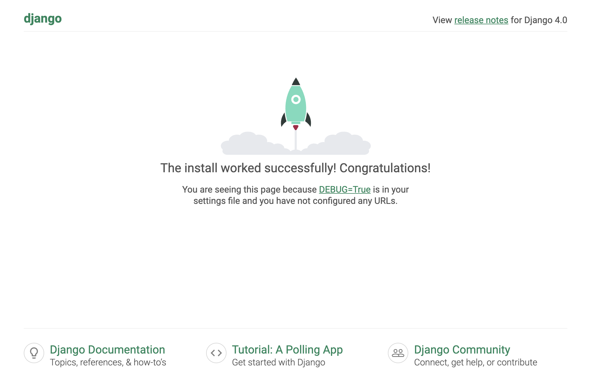

# [django](https://www.djangoproject.com/)

Django framework guides and projects

## Installation
### [windows/linux](https://developer.mozilla.org/en-US/docs/Learn/Server-side/Django/development_environment)

### [mac](https://developer.mozilla.org/en-US/docs/Learn/Server-side/Django/development_environment)
django framework needs to be installed in a virtual environment
for that:
1. install virtual environment
2. create a new venv by ```python3 -m venv {name}```
3. now that venv is created, activate it by ```source {name}/bin/activate```
4. now install django in the virtual environment by ```pip3 install django```
5. start the project by ```django-admin start project {project_name}```
6. change to the project directory and run ```python3 manage.py runserver```
7. if everything is installed correctly, you’ll get a url which when run in a web browser, gives result like this 
